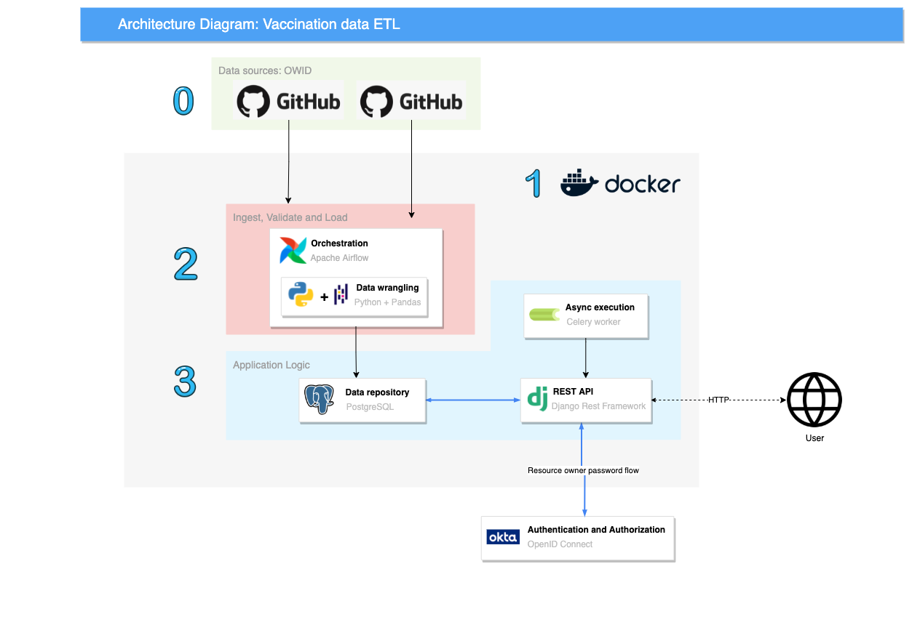

# Github Our World in Data vaccine data ETL.


## Architecture 

## 0 - Data sources 

Our World in Data maintains a Github [repository](https://github.com/owid/covid-19-data/tree/master/public/data/vaccinations) of vaccination data in CSV format. Various data points, including location, iso country code, total_vaccinations, daily_vaccinations and total_boosters are are tracked for over 200 countries/regions

The ISO 3166 defined country codes are also maintained in a Github [repository](https://github.com/lukes/ISO-3166-Countries-with-Regional-Codes). Along with country codes, other attributes are included such as region, sub-region and intermediate-region.

These two data sources are consolidated through a ETL process to produce a single view with a rich number of vaccine related dimensions and metrics
## 1 - Development environment
### Project Structure

```
.
├── Makefile                # Entrypoint to interface with development environment via sh commands
├── README.md
├── docker-compose.yml      # Definition of development environment services 
├── pytest.ini              # Pytest configuration
├── setup.cfg               # Flake 8 configuration
├── docker-scripts          # Service init/entrypoint scripts
│   ├── django
│   ├── entrypoint.sh
│   └── postgres
├── media                   # ReadMe media artifacts
├── src                     
│   ├── airflow             # Airflow home
│   └── django              # Django API logic
└── test                    # Pytest unit tests
    ├── airflow
    └── django
```
### Getting started

Everything required to locally replicate the architecture/implementation displayed above is contained in this repository. 

Docker and Docker Compose are used configure and run all services contained in this project. **Note:** All service configurations are strictly only to be used when developing locally. 
In the root directory, a  `Makefile` provides a set of useful commands to create and interact with resulting docker containers. Run `make help` for detailed breakdown.

## 2 - Extract Transform Load
[Read more](/src/airflow/README.md)
## 3 - API 
[Read more](/src/django/README.md)


## 4 - Still to come
Airflow 
1. Unit tests
2. CI pipeline
3. Vaccine metric forecasting/analytics 

Django
1. Fix positioning of /graph_report/ graphs and labels
1. Rate-limiting 
2. Refresh Okta access token graph
<br>
