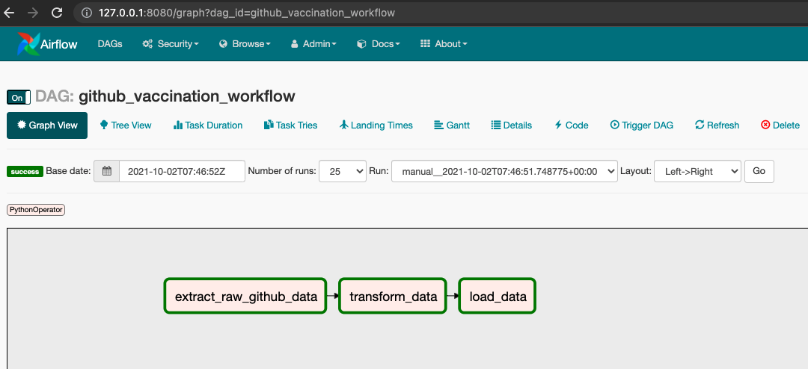

# Airflow

## Local Development

Bitnami Airflow images are used in this project when creating the respective airflow containers. 
More information relating to their setup/configuration can be found at [https://github.com/bitnami/bitnami-docker-airflow](https://github.com/bitnami/bitnami-docker-airflow). This installation has been setup to use a `CeleryExecutor` as to mimic a production environment as closely as possible. 

Start the Airflow webserver, scheduler and worker
```bash
➜ make airflow_start
docker-compose up -d airflow-scheduler airflow-worker airflow 
Starting vaccine-etl_postgresql_1 ... done
Starting vaccine-etl_redis_1      ... done
Starting vaccine-etl_airflow-scheduler_1 ... done
Starting vaccine-etl_airflow-worker_1    ... done
Starting vaccine-etl_airflow_1           ... done
```

**NOTE**: These containers can take up to 2 minutes to startup. Run `make logs` to inspect whether these services have successfully started up

## ETL 
The `github_vaccination_workflow` [DAG](/src/airflow/dags/github_vaccine_dag.py) requests vaccination data, in CSV form, from the Github Our World in Data repository, cleans and validates this data using Pandas, and finally stores the results it in a Postgres database.




The DAG is comprised of 3 steps:

1. **Extract** - Make HTTP GET request to https://raw.githubusercontent.com/owid/covid-19-data/master/public/data/vaccinations/vaccinations.csv and store the body of the response as CSV in a _raw local directory_.

2. **Transform** - Read the extracted CSV from the _raw local directory_ into a pandas dataframe. Use the `transformations` list argument to build a _transformation pipeline_ and map reduce the transformations onto the dataframe to clean/supplement the raw data. Write the resulting dataframe to the _transformed local directory_ as a CSV.

3. **Load** - Read the transformed CSV from the _transformed local directory_ into a pandas dataframe. Truncate the existing vaccination data table and load the dataframe into the that table.
    Archive the transformed file by copying it over the _archive local directory_

## Implementation details

### _Local directories_

Preferably, a Cloud Storage bucket would of been the choice of an unstructured data store for the raw/transformed/archived files. 

As an local development alternative, a hostPath volume `./airflow_data:/opt/airflow_data/` is used . When the CSV file is extracted from Github, it is stored under the `/opt/airflow_data/raw/` directory in the container which maps to `./airflow_data/raw/` in our local filesystem. This file will then be read in and transformed with the result being stored in `/opt/airflow_data/transformed/` and finally after the transformed file is loaded into Postgres, it is archived in `/opt/airflow_data/archive/`

The directory in which an ingested file is archived into corresponds to the timestamp of it's Airflow DAG execution, ie: they will be stored in a directory matching the format `/archive/%Y/%m/%d/%H/%M/%S%f%z/vax_data.csv`. This allows us to roll back our data to any previous point in time if necessary. The files stored in _raw/transformed local directories_ are also named according to the execution timestamp which aids in debugging and validating the extract and transform steps. This also ensures there's a relationship between the files in the raw, transformed and archive directories giving us a view, for each DAG run, how the file came in it's raw format, what operations were performed during the transformations and what file was eventually loaded into Postgres.


### Environment Adapter

The `github_vaccination_workflow` [DAG](/src/airflow/dags/github_vaccine_dag.py) requires a number of configurations like:
- `DATA_URL` - Which URL to retrieve vaccine data from 
- `DESTINATION_DATABASE_XXX`= Destination database connection details such as the username and password, host/table name and port number.
- `IMPORT_FILE_PATH` - This project injects those configurations as environment variables. 

The initialization of the `EnvironmentAdapater` [class](/src/airflow/dags/utilities/environment_adapter.py) ensures the required environment are set and provides access to these values through it's attributes. The definition of the expected environment variables are done in `docker-compose.yaml` which in turn reads the values from the `.env` in the root project directory

### Transformations

The CSV vaccine data from the OWID Github repository contains valuable raw data. The goal of transforming this data is to augment it such that we are able to extrapolate more accurate and in depth knowledge and insights. Pandas was used to facilitate the transformations where the raw CSV extracted from Github is loaded into a dataframe and a series of declared cleaning/supplementing operations are mapped onto the dataframe.

The [factory.py](/src/airflow/dags/utilities/transformation/factory.py) file defines two abstractions, 
`Transformer` which is responsible for how a dataframe transformation is implemented and `TransformerFactory` which is responsible for how a `Transformer`instance is created. 

This allows each implementation of a `Transformer` to be standalone (in it's own file under
the `/src/airflow/dags/utilities/transformation/` directory). This means that in order to add a new transformer `AddColumnTransformer`, which adds a new column with some default value, a new python file `sdd_column_transformer.py` can be added with the following class implementation 
```python
from .factory import Transformer


class AddColumnTransformer(Transformer):
    """Given a mapping dictionary, rename columns."""

    def __init__(self, column_name: str, default_value: Any = None):

        self.column_name = column_name
        self.default_value = default_value

    def apply(self, df: pd.DataFrame) -> pd.DataFrame:
        ...

        return df
```

The transformations to apply are defined in the list `transformations` variable on line 33 of The `github_vaccination_workflow` [DAG](/src/airflow/dags/github_vaccine_dag.py) DAG. Each dictionary element of this list specify the class name of the `Transformer` to be run as well as all the required arguments. For the example `Transformer` seen above the following dictionary would be used 
```json
transformations = [
        {
            "name": "AddColumnTransformer",
            "column_name": "Heard Immunity",
            "default_value": false
        },
        ...
]
```
