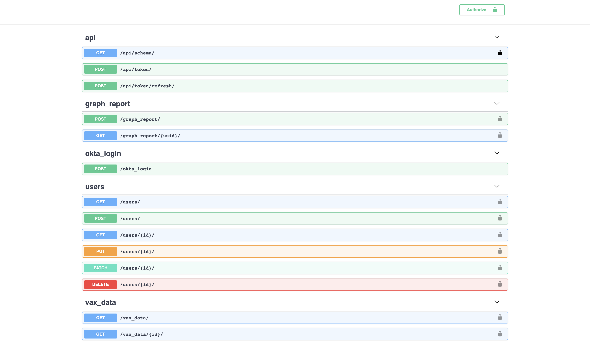
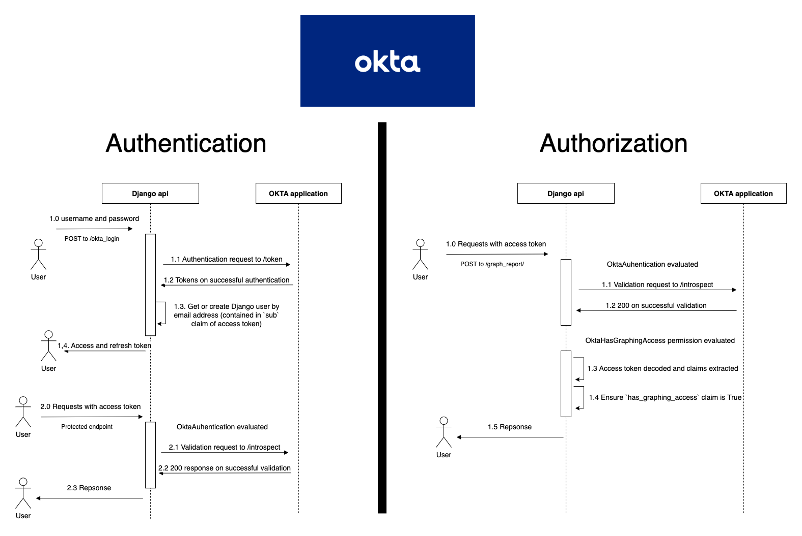

# Django API

_A swagger url is available at `<BASE_URL>/api/schema/swagger-ui/` and it documents all exposed endpoints and their respective query parameters, requests and responses._


## Local Development

0 - **Setting up a local django enviroonment.'**

 This step is necessary to prepare the database with 1) the required migrations and 2) a superuser to use for authentication. It also generates all static files the django api serves by default.

 ```bash
make django_create
echo "Ensuring python3 exists"
Ensuring python3 exists
which python3
/Users/keatonpennels/.pyenv/shims/python3
echo "Creating virtualenv and installing requirements"
Creating virtualenv and installing requirements
python3 -m venv venv
(source venv/bin/activate; venv/bin/pip install -r src/django/requirements.txt;)
Looking in indexes: https://pypi.org/simple
Collecting coverage~=5.5
  Using cached coverage-5.5-cp38-cp38-macosx_10_9_x86_64.whl (207 kB)
...
Successfully installed Django-3.1.14 PyJWT-1.7.1 PyYAML-6.0 amqp-5.0.9 asgiref-3.5.0 attrs-21.4.0 billiard-3.6.4.0 celery-5.2.3 certifi-2021.10.8 cffi-1.15.0 cfgv-3.3.1 charset-normalizer-2.0.12 click-8.0.3 click-didyoumean-0.3.0 click-plugins-1.1.1 click-repl-0.2.0 coverage-5.5 cryptography-36.0.1 distlib-0.3.4 django-celery-results-2.2.0 django-cors-headers-3.5.0 django-environ-0.4.5 django-extensions-3.1.5 django-filter-21.1 django-okta-auth-0.8.0 djangorestframework-3.11.2 djangorestframework-filters-1.0.0.dev2 djangorestframework-simplejwt-4.6.0 drf-spectacular-0.14.0 ecdsa-0.17.0 environs-9.3.5 filelock-3.4.2 gunicorn-20.0.4 identify-2.4.9 idna-3.3 importlib-resources-5.4.0 inflection-0.5.1 iniconfig-1.1.1 jsonschema-4.4.0 kombu-5.2.3 marshmallow-3.14.1 nodeenv-1.6.0 packaging-21.3 platformdirs-2.5.0 pluggy-1.0.0 pre-commit-2.7.1 prompt-toolkit-3.0.28 psycopg2-binary-2.8.6 py-1.11.0 pyasn1-0.4.8 pycparser-2.21 pyparsing-3.0.7 pyrsistent-0.18.1 pytest-6.2.5 pytest-django-4.4.0 pytest-mock-3.6.1 python-dotenv-0.19.2 python-jose-3.3.0 pytz-2021.3 redis-3.5.3 requests-2.27.1 rsa-4.8 six-1.16.0 sqlparse-0.4.2 toml-0.10.2 uritemplate-4.1.1 urllib3-1.26.8 vine-5.0.0 virtualenv-20.13.1 wcwidth-0.2.5 zipp-3.7.0
WARNING: You are using pip version 20.2.1; however, version 22.0.3 is available.
You should consider upgrading via the '/Users/keatonpennels/Documents/Vaccines/vaccine-etl/venv/bin/python3 -m pip install --upgrade pip' command.
docker-compose up -d django-webserver celery-worker
vaccine-etl_postgresql_1 is up-to-date
vaccine-etl_redis_1 is up-to-date
vaccine-etl_django-webserver_1 is up-to-date
vaccine-etl_celery-worker_1 is up-to-date
./venv/bin/python3 src/django/manage.py migrate
Operations to perform:
  Apply all migrations: admin, auth, contenttypes, core, django_celery_results, github_vax, sessions
Running migrations:
  No migrations to apply.
./venv/bin/python3 src/django/manage.py createsuperuser
Username: username
Email address: user@user.com
Password:
Password (again):
Superuser created successfully.
./venv/bin/python3 src/django/manage.py collectstatic

You have requested to collect static files at the destination
location as specified in your settings:

    /Users/keatonpennels/Documents/Vaccines/vaccine-etl/src/django/api_config/static

This will overwrite existing files!
Are you sure you want to do this?

Type 'yes' to continue, or 'no' to cancel: yes

170 static files copied to '/Users/keatonpennels/Documents/Vaccines/vaccine-etl/src/django/api_config/static'.
 ```


1.a - **Running Django locally.**
```bash
➜ make django_run_locally
docker-compose up -d celery-worker
Starting vaccine-etl_postgresql_1 ... done
Starting vaccine-etl_redis_1      ... done
Starting vaccine-etl_celery-worker_1 ... done
echo "Ensuring virtualenv exists"
Ensuring virtualenv exists
echo "Creating virtualenv and installing requirements"
Creating virtualenv and installing requirements
python3 -m venv venv
(source venv/bin/activate; venv/bin/pip install -r src/django/requirements.txt;)
Looking in indexes: https://pypi.org/simple
Requirement already satisfied: coverage~=5.5 in ./venv/lib/python3.8/site-packages (from -r src/django/requirements.txt (line 1)) (5.5)
...
echo "Running development server"
Running development server
./venv/bin/python3 src/django/manage.py migrate
Operations to perform:
  Apply all migrations: admin, auth, contenttypes, core, django_celery_results, github_vax, sessions
Running migrations:
  No migrations to apply.
./venv/bin/python3 src/django/manage.py runserver
Watching for file changes with StatReloader
Performing system checks...

System check identified no issues (0 silenced).
February 13, 2022 - 17:50:26
Django version 3.1.14, using settings 'api_config.settings'
Starting development server at http://127.0.0.1:8000/
Quit the server with CONTROL-C.
```

1.b -  **Running Django as a container**
```bash
➜ make django_start
docker-compose up -d django-webserver celery-worker
Starting vaccine-etl_redis_1      ... done
Starting vaccine-etl_postgresql_1 ... done
Starting vaccine-etl_celery-worker_1    ... done
Creating vaccine-etl_django-webserver_1 ... done
```

**NOTE**: These containers can take up to 2 minutes to startup. Run `make logs` to inspect whether these services have successfully started up

### Loading data

This project's intention is use Airflow and the `github_vaccine_dag.py` [DAG](/src/airflow/dags/github_vaccine_dag.py) to periodically import vaccine related data into the Django Postgres database.

If you would like to skip setting up Airflow and using the DAG, a django fixture, https://docs.djangoproject.com/en/4.0/howto/initial-data/, can be used to import an initial dataset. Running the below command, in the root of the project directory, will import data from Jan - Dec 2021:

```bash
vaccine-etl
➜ cd src/django/
vaccine-etl/src/django
➜ python manage.py loaddata github_vax_data/2021.json

Installed 72864 object(s) from 1 fixture(s)
```

## Authentication and Authorization



### **Authentication**

All endpoints besides the the JWT related endpoints (`/api/token/`, `/api/token/refresh/` and `/okta_login`) require a Bearer token to be included in the Authorization HTTP header. The paragraphs below will explian the different token authentication flows supported by the API.
#### Okta OpenID Connect OAuth2

The following documentation relates resource owner password grant type flow. For more background on these topics, read the following articles:
https://developer.okta.com/docs/guides/implement-grant-type/ropassword/main/.

**NOTE**: In order to use `OktaAuthentication`, you need to be added to my Okta application (or provide your own client ID and secret of an application that supports  resource owner password authentication). I'll be happy to add anyone who is wanting to to test this authentication flow. Send me an email and I'll gladly arrange the necessary logins.

On login, it expects a username password combination, the combination that was created when a user is added to the Okta application, and returns the access and refresh tokens on success.

Request Okta JWT access token - `POST /okta_login`
| Request | Response |
|---------|----------|
| <code> {"username": "string","password": "string"} </code> | <code> {"access": "string","refresh": "string","expires_in": "integer"} </code> |

When making requests to any protected endpoint, the Okta access token should be added to the Authorization header with the `Bearer` prefix, ie:
```http
AUTHORIZATION: Bearer <okta_access_token>
```
On reception of a `Authorization` header with a Bearer prefix, the `OktaAuthentication` authentication class will evaluate the contained token.

#### Django JWT
As an alternative to the Okta authentication flow, this API also supports the minting and verification of it's own JWTs. This support is provided by the 3rd party package
https://django-rest-framework-simplejwt.readthedocs.io/en/latest/getting_started.html#getting-started. On login, it expects a username password combination, the same combination that was created when running `make django_create` or `manage.py createsuperuser`, and returns the access and refresh tokens on success.

<br>

Request JWT access and refresh token - `POST /api/token/`
| Request | Response |
|---------|----------|
| <code> {"username": "string","password": "string"} </code> | <code> {"access": "string","refresh": "string"} </code> |
<br>

Refresh access token using refresh token - `POST /api/token/refresh/`
| Request | Response |
|---------|----------|
| <code> {"refresh": "string"} </code> | <code> {"access": "string"} </code> |

In order to allow for both `JWTAuthentication` and `OktaAuthentication` at the same time, the API was configured to support an additional Bearer token prefix `JWT` ie:
```http
AUTHORIZATION: JWT <django_jwt_token>
```
On reception of a `Authorization` header with a JWT prefix, the `JWTAuthentication` authentication class will evaluate the contained token.

### **Authorization**

Authorization is only currently supported when using `OktaAuthentication`

The below payload contains some of the claims in Okta access tokens minted for this application.
```json
{
    "ver": 1,
    "jti": "WT.NEHwDFo-fILIpoV10iM8J1E7jg9999kaEmY-3TLZZMCo",
    "iss": "https://dev-46582267.okta.com/oauth2/default",
    "aud": "api://default",
    "iat": 1645300641,
    "exp": 1645304241,
    "scp": [
      "profile",
      "email",
      "openid"
    ],
    "sub": "keaton@gmail.com",
    "has_graphing_access": true
}
```

A custom Django permission class `OktaHasGraphingAccess` is used to enforce endpoint level authorization. The JWT contained in the Authorization header is decoded and and the `has_graphing_access` boolean claim is evaluated. Only if this claim is true will the request be processed.

## Implementation details

### Environment configuration
There are two choices to make when configuring the Django environment

1. Authentication - If the `USE_OKTA_AUTH` environment variable is set to False, Django JWT authentication will be used. Otherwise Okta authentication will be used and the environment variables prefixed with `OKTA_` will have to be set to valid values.

#TODO - Move celery broker in celery.py to env file

2. Asynchronous graph report generation - If the `DELAY_CELERY_TASKS` environment variable is set to False, the execution `/graph_report/` will occur synchronously

### Vaccine Data filtering

## Tests
